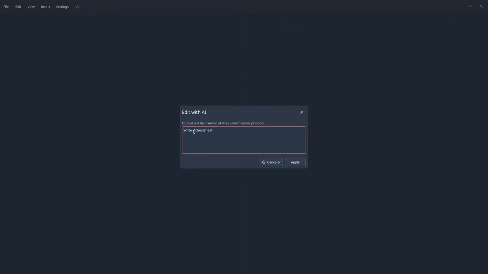

<p align="center">
  
</p>

<h1 align="center">SimpleMD</h1>

<p align="center">
  A minimal KDE markdown editor with live preview.
</p>


## Features

- **Split-pane editing** — write markdown on the left and see a live preview on the right
- **Rich preview** — math (KaTeX), chemistry (mhchem), and Mermaid diagrams via Qt WebEngine
- **Document outline** — navigate headings in long documents
- **Insert menus** — quick access to common markdown, math, and citation snippets
- **Light AI editing** — one optional “Edit with AI” command for quick rewrites and insertions (see below)
- **PDF export** — print or save documents from the preview
- **KDE-native** — Kirigami UI, desktop theming, and full-screen focus mode

## AI-assisted editing

SimpleMD includes a deliberately small AI feature: one command, one dialog, and direct application of the result. There is no chat panel, no preset action menu, no streaming, and no diff review step — the goal is a fast helper for small markdown edits, not a full writing assistant.

AI is entirely optional: without an API key, the rest of the editor works as usual. Requests are sent only when you explicitly run **Edit with AI**.

<p align="center">
  <a href="docs/simplemd-demo.mp4">
    
  </a>
</p>

## Building

### Arch / Manjaro

From the repository root:

```bash
./scripts/install-manjaro.sh
```

Or build the package manually:

```bash
cd packaging/arch
makepkg -si
```

### From source (CMake)

Install the dependencies listed in `packaging/arch/PKGBUILD`, then:

```bash
cmake -B build -DCMAKE_BUILD_TYPE=Release -DCMAKE_INSTALL_PREFIX=/usr
cmake --build build --parallel
sudo cmake --install build
```

## Usage

Launch from your application menu or run:

```bash
simplemd
```

## Dependencies

SimpleMD is built with Qt 6 and KDE Frameworks 6. The live preview bundles several JavaScript libraries under `resources/preview/vendor/`.

### Runtime

| Dependency | Arch package | License |
| --- | --- | --- |
| [Qt 6](https://www.qt.io/) (Core, Quick, Gui, Network, Quick Controls 2, Widgets, Print Support, PDF, WebChannel) | `qt6-base`, `qt6-declarative` | LGPL-3.0-only |
| [Qt WebEngine](https://doc.qt.io/qt-6/qtwebengine-index.html) | `qt6-webengine` | LGPL-3.0-only; includes [Chromium](https://www.chromium.org/) (BSD-3-Clause and other licenses) |
| [Kirigami](https://develop.kde.org/docs/plasma/kirigami/) | `kirigami` | LGPL-2.1-or-later |
| [KI18n](https://api.kde.org/frameworks/ki18n/html/) | `ki18n` | LGPL-2.0-or-later |
| [KCoreAddons](https://api.kde.org/frameworks/kcoreaddons/html/) | `kcoreaddons` | LGPL-2.0-or-later |
| [QQC2 Desktop Style](https://invent.kde.org/frameworks/qqc2-desktop-style) | `qqc2-desktop-style` | LGPL-2.0-or-later |
| [KIconThemes](https://api.kde.org/frameworks/kiconthemes/html/) | `kiconthemes` | LGPL-2.0-or-later |

### Build-only

| Dependency | Arch package | License |
| --- | --- | --- |
| [CMake](https://cmake.org/) | `cmake` | BSD-3-Clause |
| [Extra CMake Modules](https://api.kde.org/ecm/) | `extra-cmake-modules` | BSD-2-Clause |
| [Qt 6 tools](https://www.qt.io/) | `qt6-tools` | LGPL-3.0-only |

### Bundled preview libraries

These are vendored into the application for markdown rendering in the preview pane:

| Library | Upstream | License |
| --- | --- | --- |
| [marked](https://github.com/markedjs/marked) | `resources/preview/vendor/marked.min.js` | MIT |
| [KaTeX](https://katex.org/) | `resources/preview/vendor/katex.min.js`, `katex.min.css` | MIT |
| [mhchem](https://github.com/KaTeX/KaTeX/tree/main/contrib/mhchem) (KaTeX extension) | `resources/preview/vendor/contrib/mhchem.min.js` | Apache-2.0 |
| [Mermaid](https://mermaid.js.org/) | `resources/preview/vendor/mermaid.min.js` | MIT |

Mermaid bundles additional third-party components (for example Lodash, DOMPurify, and js-yaml) under their respective licenses. See the bundled license comments at the end of `mermaid.min.js` for details.

## License

SimpleMD is licensed under **GPL-3.0-or-later**.
