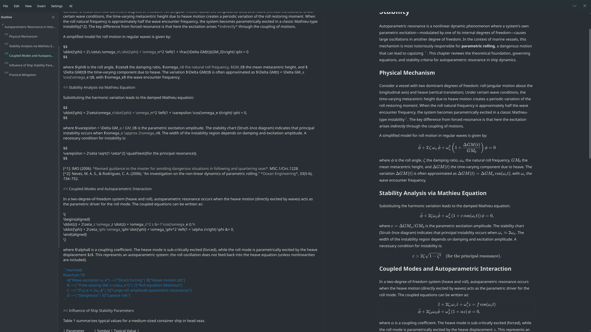
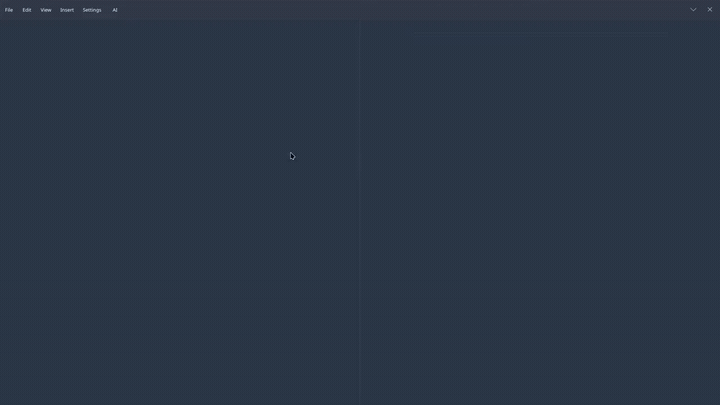

<p align="center">
  
</p>

<h1 align="center">SimpleMD</h1>

<p align="center">A minimal KDE markdown editor with live preview.</p>

<p align="center"><strong>Work in progress.</strong> A personal project built for a low-noise neurodivergent workflow.</p>

## About

SimpleMD is spartan: a split editor, a live preview, and little else. No plugin system, no cloud sync, no bloated toolbar. Just markdown rendered well in a focused full-screen window and a minimal AI assistant because I'm fed up with writing formulae in LaTeX.

There are **no published packages**. On Manjaro / Arch, use the install script below.



## Features

- **Split-pane editing.** Markdown on the left, live preview on the right.
- **Single pane mode.** Markdown comfortably centered when expression matters.
- **Rich preview.** Math (KaTeX), chemistry (mhchem), Mermaid diagrams, …
- **Document outline.** Jump between headings in long documents.
- **Insert menus.** Snippets for common markdown, math, basic chemistry, citations, …
- **Images.** Insert or paste; on save, optionally copy into an `images/` folder beside the document.
- **PDF export.** Print or save from the preview with basic formatting options.
- **Light AI editing.** One optional command for quick rewrites (see below).
- **KDE-native.** Kirigami UI, desktop theming, full-screen focus mode.

## AI-assisted light editing

One dialog, direct apply. No chat panel, presets, streaming, or diff review.



Any **OpenAI-compatible** `/chat/completions` endpoint works:

| Setup | API base URL | API key |
| --- | --- | --- |
| Cloud (OpenAI, DeepSeek, …) | Provider URL | Your API key |
| Local (Ollama, llama.cpp, LM Studio, …) | e.g. `http://127.0.0.1:11434/v1` | Whatever the server expects (often any placeholder) |

Configure **API base URL**, **Model**, and related options in **Settings → Preferences…** (AI section).

**Privacy:** each request sends your instruction plus either the current selection or ~1,200 characters of context around the cursor or the selected text to the configured server. **With an external provider, that content leaves your machine**.

**Security:** the API key is stored in Qt settings on disk **in plain text** (not encrypted yet).

AI is optional. Without it, the editor runs normally (offline aside from WebEngine’s usual needs).

## Install

On Manjaro / Arch, from the repository root:

```bash
./scripts/install-manjaro.sh
```

The script installs dependencies, builds a local package, and installs it with `pacman`. Do not run it as root. Launch with `simplemd` or from the application menu.

## Uninstall

Remove SimpleMD and dependencies that no other installed package needs:

```bash
sudo pacman -Rs simplemd
```

Pacman keeps removed config files as `.pacsave` entries. Add `-n` (`-Rns`) if you also want those config files deleted.

To remove leftover orphan packages, list them first and confirm the output looks right:

```bash
pacman -Qtdq
sudo pacman -Rns $(pacman -Qtdq)
```

Skip the second command if the list includes packages you still want, or if `pacman -Qtdq` prints nothing.

## Third-party licenses

See `THIRD_PARTY_LICENSES.md` for bundled vendor assets and Mermaid-related third-party licensing details.

## License

SimpleMD is licensed under **GPL-3.0-or-later**. See `LICENSE`.
